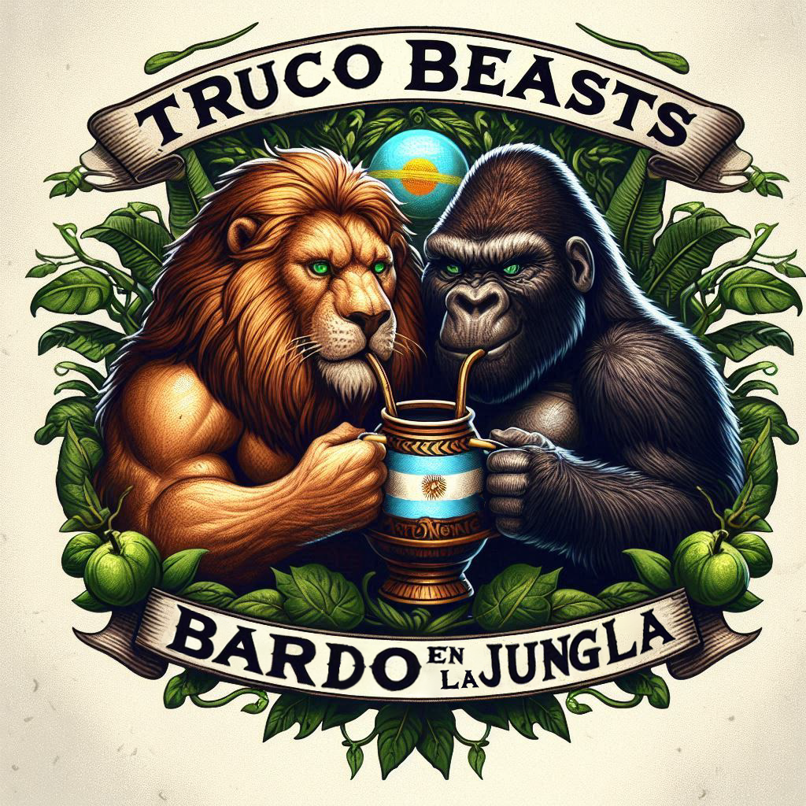

# Truco Beasts: Bardo en la Jungla®


### Desarrollado por: 
  - Eloy Sancho Cebrero
  - Maria del Pino Peréz Dominguéz
  - David Valencia Toscano
  - Paula Rosa Gonzaléz Páez
  - Iván Fernández Limarquéz 
  - Ivo Raimondi

Proyecto de un juego llamado Truco para la asignatura de DP1 de la Universidad de Sevilla. La idea de este proyecto es aplicar lo aprendido sobre arquitectura SPA con React, Java y Spring.  

## ¿Que es el Truco?
El truco es un juego de cartas que usa la baraja española de 40 naipes y cuyo objetivo es llegar a 15 o 30 puntos utilizando engaño, estrategia y astucia. Se divide en varias manos comformandose cada una de 3 rondas. Tiene diversos cantos como envido, flor y truco con los que podrás ganar más puntos.

## Video explicativo:
<a href="https://www.youtube.com/watch?v=IAKDghOqNaM">aprende a jugar como un maestro del truco apretando acá</a>

## Inicializar Truco Beast: Bardo en la Jungla® localmente
Truco Beasts: Bardo en la Jungla® es una aplicacion [Spring Boot](https://spring.io/guides/gs/spring-boot) construida usando [Maven](https://spring.io/guides/gs/maven/). Podés descargarla desde la ventana de comandos siguiendo estos pasos:


```
git clone https://github.com/gii-is-DP1/DP1-2024-2025--l6-5
cd DP1-2024-2025--l6-5
./mvnw package
java -jar target/*.jar
```

Se puede acceder al backend de está aplicacion utilizando este link: [http://localhost:8080/](http://localhost:8080/swagger-ui/index.html)

Se puede iniciar directamente desde Maven usando el plugin de Spring Boot Maven. Si se hace esto se van a tener en cuenta los cambios que haces en el proyecto inmediatamente (los cambios a archivos Java necesitan compilarse tambien - la mayoria utiliza un IDE para esto):

```
./mvnw spring-boot:run
```

## ¿Qué hacer en Truco Beasts: Bardo en la Jungla®?

### Como usuario

* Primero puedes registrarte. Crea tu propio perfil y personalízalo como quieras.
* Juega una partida creando una nueva (con tus preferencias) o uniéndote a una ya existente.
* Consultar tus estadísticas, tus logros y los que aún te quedan por conseguir.

### Como administrador

* Gestionar las cuentas de los usuarios registrados.
* Observar una lista de partidas en juego.
* Crear logros nuevos o editar los ya existentes

## En caso de que encuentres un bug o tengas alguna sugerencia para Truco Beasts
El issue tracker del proyecto: https://github.com/gii-is-DP1/DP1-2024-2025--l6-5/issues

## Configuracion base de datos
En su configuracion por defecto, Truco Beasts usa una base de datos en memoria (H2) la cual se 
se rellena con datos previamente escritos. Los INSERTs se especifican en el archivo data.sql.

## Trabajando con Truco Beasts: Bardo en la Jungla® en tu IDE

### Requisitos previos
Se necesita tener instalado:
* Java 17 o superior.
* Node.js 18 o superior.
* Herramienta para comandos de git (https://help.github.com/articles/set-up-git)
* Tu IDE favorito 
  * Eclipse con el plugin m2e. Nota: cuando m2e está disponible, hay un icono m2 en `Help -> About`. si m2e no se encuentra ahí, seguir este tutorial: https://www.eclipse.org/m2e/
  * [Spring Tools Suite](https://spring.io/tools) (STS)
  * IntelliJ IDEA
  * [VS Code](https://code.visualstudio.com)

### Pasos:

1) En la línea de comandos
```
git clone https://github.com/gii-is-DP1/DP1-2024-2025--l6-5.git
```
2) En Eclipse
```
File -> Import -> Maven -> Existing Maven project
```

Entonces se construye en la línea de comando ./mvnw generate-resources o usando el launcher de Eclipse (clic derecho en el proyecto y Run As -> Maven install) para generar el css. Inicializa el método principal de la apliacción usando clic derecho en él y seleccionando Run As -> Java Application..

3) Dentro de IntelliJ IDEA

En el menu principal, apretar `File -> Open` y seleccionar el [pom.xml](pom.xml) del proyecto. Apretar el boton `Open`.

Los archivos CSS son generados en la construcción de Maven. Tambien se pueden escribir en la linea de comandos `./mvnw generate-resources`
o haciendo click derecho en el proyecto `DP1-2024-2025--l6-5` y luego `Maven -> Generates sources and Update Folders`.

Una configuracion de ejecucion llamada `GameApplication` deberia haber sido creada si estás usando la version reciente Ultimate. De otra manera, puede iniciar la aplicaccion cliclando la clase main `GameApplication` y apretando `Run 'PetClinicApplication'`.

4) Navegar al truco
Entre a [http://localhost:8080/swagger-ui/index.html](http://localhost:8080/swagger-ui/index.html) en su buscador preferido.


## ¿Buscando algo en particular?

| Configuracion Spring Boot | Clase o archivo de propiedades Java  |
|--------------------------|---|
|Clase Main | [GameApplication](src/main/java/es/us/dp1/lx_xy_24_25/your_game_name/GameApplication.java) |
|Archivos de propiedades | [application.properties](https://github.com/gii-is-DP1/DP1-2024-2025--l6-5/blob/main/src/main/resources) |


## Inicializar el frontend

Truco Beasts: Bardo en la Jungla® está implementado con un frontend React en la carpeta llamada "frontend".
Puedes iniciar el servidor de desarrollo para ver el frontend usando el comando (quizás antes deberías usar el comando `npm install`): 
```
npm start
```
Puedes acceder al frontend de Truco Beasts: Bardo en la Jungla® en [http://localhost:3000](http://localhost:3000)
