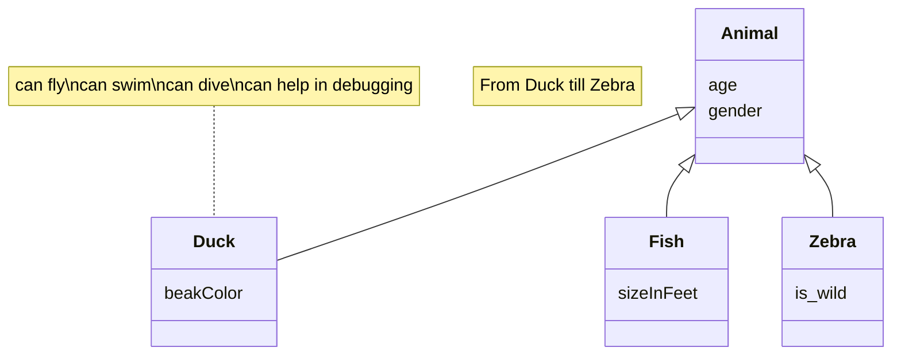

# Documento de análisis de requisitos del sistema

_Esta es una plantilla que sirve como guía para realizar este entregable. Por favor, mantén las mismas secciones y los contenidos que se indican para poder hacer su revisión más ágil._ 

## Introducción

Truco Beasts: Bardo en la Jungla® está basado en el juego del truco y pretendemos implementar todo lo que explicaremos a continuación (a excepción de las partidas de a 3 y a 8 jugadores).

El truco es un juego de cartas que se juega usando la baraja española de 40 naipes y su objetivo es llegar a 15 o 30 puntos utilizando engaño, estrategia y astucia. Es un juego para 2, 3, 4, 6 e incluso 8 jugadores en el que hay 2 equipos. La duración de una partida puede variar bastante, pero lo normal oscila entra 15 y 30 minutos.
El juego se divide en varias manos y cada mano está dividida en tres rondas. Al comienzo de cada mano cada jugador tiene tres cartas y comenzará jugando el jugador que está a la derecha del que repartió las cartas (llamado "mano").

### Dinámica de juego

Cada jugador irá tirando una de sus cartas (la que crea más conveniente) y de entre las cartas que hay en la mesa se conoce el ganador teniendo en cuenta los valores de las cartas:

_No existe orden vertical, las cartas colocadas encima de otras tienen el mismo valor._

El equipo que gane dos de las tres rondas de la mano sumará 1 punto. En caso de empate en una ronda se guardará el ganador para la siguiente (es decir, el que gane la siguiente ganará también la ronda en la que hubo empate). Lo mismo ocurrirá si vuelve a haber un empate. En caso de empates en las tres rondas, ganará el equipo al que pertenezca el jugador mano.
Además, existen tres cantos con los que ganar puntos adicionales. Estos son el truco (el canto más importante), el envido y la flor.

El truco: se puede cantar en cualquier momento de la mano. Si es aceptado (diciendo "quiero") la mano se jugará a 2 puntos, aunque también puede ser rechazado (diciendo "no quiero") dando por finalizada la mano y llevándose el equipo del jugador que lo cantó 1 punto o los puntos acumulados por subidas de la apuesta. Estas subidas se pueden realizar cantando "retruco" (a modo de respuesta al equipo que cantó "truco" inicialmente) siguiéndose la misma dinámica del "quiero" y el "no quiero". A su vez, este puede aumentar la apuesta aún más diciendo "vale cuatro".
El envido: sólo puede cantarse en la primera ronda y lo harán los últimos jugadores de cada equipo (cualquier jugador en caso de que sean sólo 2). Éste puede ser aceptado o rechazado de igual manera que el truco (aunque no se finaliza la mano en caso de ser rechazado). También puede subirse la apuesta con cantos como "envido" (otra vez), "real envido" y "falta envido". En el vídeo se muestra la puntuación de este canto de manera más detallada.
La flor: es un regalo del mazo y antes de crear la partida se puede elegir si jugar con ella o no. Consiste en tener tres cartas del mismo palo. Sólo podrán cantarla si la tienen realmente. En caso de que otro jugador también tenga flor puede responder a esta diciendo "contraflor" o "contraflor al resto". Se comparan los puntos de la misma forma que en el envido. Nuevamente, en el vídeo hay más detalle sobre este canto.

Para que los jugadores del mismo equipo se comuniquen existen señas (puesto a que no pueden ver las cartas de sus compañeros) relacionadas con las distintas cartas que hay. Estas señas también se suelen utilizar muy a menudo para engañar al equipo contrario.

[Para una noción más detallada del juego, este vídeo explicativo es de gran ayuda](https://www.youtube.com/watch?v=IAKDghOqNaM)

## Tipos de Usuarios / Roles

< Nombre Rol >: < Breve descripción del rol >

_Ej1: Propietario: Dueño de una o varias mascota que viene a la clínica para mantenerla sana y cuidar de su salud._

_Ej2: Veterinario: Profesional de la salud animal con titulación universitaria homologada, está registrado en la clínica y se encarga de realizar diagnósticos y recetar tratamientos. Además mantiene actualizado el vademécum._

_Ej3: Administrador: Dueño de la clínica que se encarga de dar de alta veterinarios y gestionar la información registrada en la aplicación de la clínica._

## Historias de Usuario

A continuación se definen  todas las historias de usuario a implementar:
_Os recomentamos usar la siguiente plantilla de contenidos que usa un formato tabular:_
 ## Historia de Usuario Creación y configuración partidas:
 ### HU-(ISSUE#59): Crear partidas ([https://github.com/gii-is-DP1/DP1-2024-2025--l6-5/issues/59]())
Como jugador quiero que el sistema me permita crear las partidas para poder jugar  
 ### HU-(ISSUE#60): Editar los puntos de la partida ([https://github.com/gii-is-DP1/DP1-2024-2025--l6-5/issues/60]())
Como jugador quiero que el sistema me permita poder editar las partidas para decidir la puntuación (15 o 30)  
 ### HU-(ISSUE#61): Editar la flor en la partida ([https://github.com/gii-is-DP1/DP1-2024-2025--l6-5/issues/61]())
Como jugador quiero que el sistema me permita editar las partidas para decidir si se juega con flor 
 ### HU-(ISSUE#62): Editar numero de jugadores de la partida ([https://github.com/gii-is-DP1/DP1-2024-2025--l6-5/issues/62]())
Como jugador quiero que el sistema me permita editar las paridas para decidir de cuantos jugadores será 
 ### HU-(ISSUE#63): Poder unirse a las partidas ([https://github.com/gii-is-DP1/DP1-2024-2025--l6-5/issues/63](Poder unirse a las partidas))
Como jugador quiero que el sistema me permita poder unirme a partidas para jugar 
 ## Historia de Usuario Jugar partidas:
 ## Historia de Usuario Aspecto social:
 ## Historia de Usuario Aspectos especificos del usuario:

|Descripción de la historia siguiendo el esquema:  "Como <rol> quiero que el sistema  <funcionalidad>  para poder <objetivo/beneficio>."| 
|-----|
|Mockups (prototipos en formato imagen de baja fidelidad) de la interfaz de usuario del sistema|
|Decripción de las interacciones concretas a realizar con la interfaz de usuario del sistema para lleva a cabo la historia. |

## Diagrama conceptual del sistema
_En esta sección debe proporcionar un diagrama UML de clases que describa el modelo de datos a implementar en la aplicación. Este diagrama estará anotado con las restricciones simples (de formato/patrón, unicidad, obligatoriedad, o valores máximos y mínimos) de los datos a gestionar por la aplicación. _

_Recuerde que este es un diagrama conceptual, y por tanto no se incluyen los tipos de los atributos, ni clases específicas de librerías o frameworks, solamente los conceptos del dominio/juego que pretendemos implementar_
Ej:

_Si vuestro diagrama se vuelve demasiado complejo, siempre podéis crear varios diagramas para ilustrar todos los conceptos del dominio. Por ejemplo podríais crear un diagrama para cada uno de los módulos que quereis abordar. La única limitación es que hay que ser coherente entre unos diagramas y otros si nos referimos a las mismas clases_

_Puede usar la herramienta de modelado que desee para generar sus diagramas de clases. Para crear el diagrama anterior nosotros hemos usado un lenguaje textual y librería para la generación de diagramas llamada Mermaid_

_Si deseais usar esta herramienta para generar vuestro(s) diagramas con esta herramienta os proporcionamos un [enlace a la documentación oficial de la sintaxis de diagramas de clases de _ermaid](https://mermaid.js.org/syntax/classDiagram.html)_

## Reglas de Negocio
### R1-Condicion para la creacion y edicion de partidas
Solo los jugadores estarán autorizados a crear o editar  partidas mediante la pulsación de un botón. 
### R2-Edicion de partidas
El sistema debe permitir al jugador modificar los campos: ‘flor’, ‘nº jugadores’ y ‘puntuación’ en la edición de la partida. 
### R3-Unión a partidas privadas
El jugador habrá de unirse a una partida privada mediante un código único. 
### R4-Visibilidad para de las partidas
En caso de no estar logado, solo serán visibles las partidas públicas (espectador) 
### R5-Espectación de la partida
Al meterte en una partida como espectador no podrás interactuar con la partida 

_Ej:_ 
### R1 – Diagnósticos imposibles
El diagnóstico debe estar asociado a una enfermedad que es compatible con el tipo de mascota de su visita relacionada. Por ejemplo, no podemos establecer como enfermedad diagnosticada una otitis cuando la visita está asociada a una mascota que es un pez, porque éstos no tienen orejas ni oídos (y por tanto no será uno de los tipos de mascota asociados a la enfermedad otitis en el vademecum).

…

_Muchas de las reglas del juego se transformarán en nuestro caso en reglas de negocio, por ejemplo, “la carta X solo podrá jugarse en la ronda Y si en la ronda anterior se jugó la carta Z”, o “en caso de que un jugador quede eliminado el turno cambia de sentido”_

